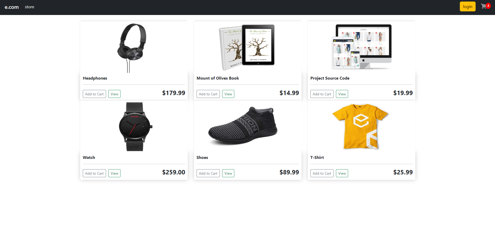
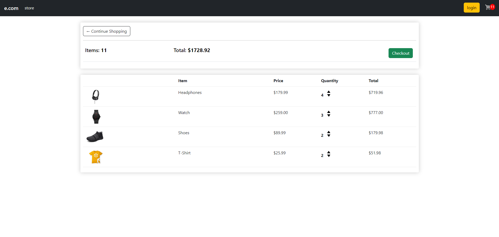
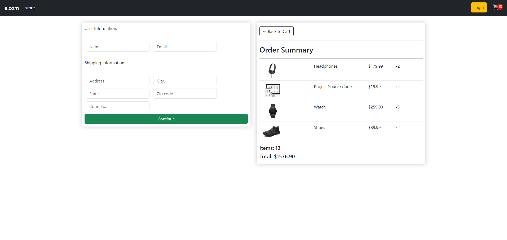

# E-Commerce Website with Django
## Description
This is a simple e-commerce website built with Django. It has the following features:
- User registration and login
- Product details
- Add to cart
- Checkout
- Payment
- Order history
- Admin dashboard

## Installation
1. Clone the repository
2. Create a virtual environment
3. Install the dependencies
4. Run the server

```
git clone
cd ecommerce
python3 -m venv venv
source venv/bin/activate
pip install -r requirements.txt
python manage.py runserver
```

## Screenshots




## License
This project is licensed under the MIT License - see the [LICENSE](LICENSE) file for details.
